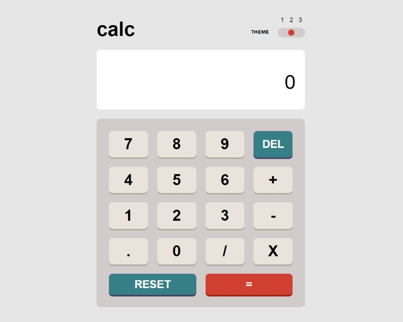

# Frontend Mentor - Calculator app solution

This is a solution to the [Calculator app challenge on Frontend Mentor](https://www.frontendmentor.io/challenges/calculator-app-9lteq5N29). Frontend Mentor challenges help you improve your coding skills by building realistic projects.

## Table of contents

- [Overview](#overview)
  - [The challenge](#the-challenge)
  - [Screenshot](#screenshot)
  - [Links](#links)
- [My process](#my-process)
  - [Built with](#built-with)
  - [What I learned](#what-i-learned)
  - [Useful resources](#useful-resources)
- [Author](#author)

## Overview

### The challenge

Users should be able to:

- See the size of the elements adjust based on their device's screen size
- Perform mathmatical operations like addition, subtraction, multiplication, and division
- Adjust the color theme based on their preference

### Screenshot



### Links

- Solution URL: (https://github.com/visheshgupta29/calculator-app)
- Live Site URL: (https://eclectic-pudding-e0d2b4.netlify.app/)

## My process

### Built with

- Semantic HTML5 markup
- CSS custom properties
- Flexbox
- CSS Grid
- Mobile-first workflow
- [React](https://reactjs.org/) - JS library
- [Styled Components](https://styled-components.com/) - For styles

### What I learned

The reason for React state updates not being reflected immediately is due to the current closure of the state variable. State updates require a re-render to reflect the updated value. When React re-renders the component, a new closure is created to reflect the new state updates.

We can use the useEffect hook to reflect any state changes. useEffect accepts a function and an array of dependencies as arguments. When one of the dependencies changes, the useEffect is re-evaluated. In this case, it guarantees to re-run whenever updateScreen, monitorVal, valHolder, clickedNum or holdNum changes.

```js
useEffect(() => {
  updateScreen(monitorVal, valHolder);
}, [updateScreen, monitorVal, valHolder, clickedNum, holdNum]);
```

When the value of a useState hook [monitorVal] depends on the changes made to another useState hook [clickedNum], I decided to create a local constant [newClickedNum] that hold the initial value of [clickedNum] and later [monitorVal]'s value is updated based on newClickedNum.

### Useful resources

- (https://www.learnbestcoding.com/post/54/react-usestate-set-does-not-reflect-immediately) - This is an amazing article which helped me finally understand the behaviour of useState's setter method. I'd recommend it to anyone still learning this concept.

## Author

- Website - [Vishesh Gupta](https://github.com/visheshgupta29)
- Frontend Mentor - [@visheshgupta29](https://www.frontendmentor.io/profile/visheshgupta29)
- Twitter - [@notvisheshgupta](https://twitter.com/notvisheshgupta)
